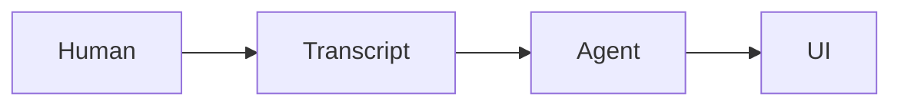

# Meeting

`meeting` is a local-first agentic meeting room.

Humans meet in a browser. Local Codex and Claude workers listen to transcript
events, raise a hand when useful, and can work in selected repositories after
the host grants permission.

## First Milestone

- P2P-ready meeting UI with transcript and agent side panel.
- Local API event bus.
- Local Whisper speech-to-text through `whisper.cpp`.
- Deepgram remains a fallback provider, not the agent brain.
- Local agent-worker scaffold for Codex or Claude subscription CLIs.
- MCP server so Claude Code / Codex can post Markdown, raise hands, set
  repository context, and create visible task cards.

## Setup

```bash
pnpm install
cp .env.example .env
bash scripts/install-daemon.sh
bash scripts/install-mcp-clients.sh
```

Open `http://localhost:5175/stable.html`.

For the Realtime voice-to-Codex demo added in this repo, open
`http://localhost:5175/realtime.html` after setting `OPENAI_API_KEY` in `.env`.
That path creates a browser WebRTC session to OpenAI Realtime, exposes local
tools for shell/Codex work, and lets the agent rewrite a live
`.meeting/realtime/index.html` preview rendered in an iframe.

The app expects real local audio. There is no mock transcript loop in the
default product path.

## Local Whisper

Install `whisper.cpp` and the multilingual small model:

```bash
bash scripts/setup-whisper.cpp.sh
```

Then start the app:

```bash
pnpm dev
```

In the UI, click **Start Whisper** to send short microphone chunks to the local
API. The API converts browser audio with `ffmpeg` and invokes `whisper-cli`.

## Realtime Codex Demo

The default Meeting product path remains local-first Whisper plus meeting
events. There is also a separate experimental demo entrypoint for a direct
OpenAI Realtime voice session:

```bash
pnpm dev
open http://localhost:5175/realtime.html
```

What it does:

- opens a WebRTC audio call to `gpt-realtime-2`;
- keeps your local camera visible in the page, but does not send video to the model;
- exposes browser-triggered tools that can run short shell commands in the
  workspace, hand off implementation work to `pi-agent`, and rewrite
  `.meeting/realtime/index.html`;
- reloads the iframe preview whenever the agent publishes new HTML.

This is intended as a local demo. The shell bridge has basic blocking for
obviously destructive commands, but it should still be treated as a trusted
developer tool, not a production-safe remote execution surface.

## Realtime Listener Mode

The main Meeting UI should be opened through `http://localhost:5175/stable.html`.
That stable parent page owns microphone permission, the OpenAI Realtime WebRTC
call, the data channel, transcript persistence, tool calls, and Pi/Codex update
injection. The React app runs inside the iframe and can hot reload without
dropping the voice session.

Behavior:

- the Realtime agent connects as an **audio responder** by default;
- clicking **Join meeting** in the stable shell starts the voice agent; there is
  no separate "connect voice agent" step;
- the stable shell auto-reconnects after transient WebRTC/data-channel failures;
- muting the Realtime agent keeps it listening silently so it can update notes,
  declare tasks, and raise a hand before speaking;
- reconnect injects a concise resume context message into the Realtime session
  so it continues from the current canvas, transcript, tasks, and Pi outputs;
- room speech is transcribed and persisted into `.meeting/events.jsonl`,
  `.meeting/session.md`, and `.meeting/pipeline/implementation/inbox/conversation.jsonl`;
- the agent can silently react by raising a hand, posting Markdown, creating
  task cards, inspecting the repo, or handing off implementation work to
  `pi-agent`;
- raw Realtime transcript is not sent directly to Codex; the Realtime agent
  sends concise JSONL handoffs with `run_codex_task`;
- `pi-agent` receives those handoffs through the existing meeting extension,
  invokes local Codex, and answers back through Meeting tools/artifacts;
- Realtime watches `pi-agent` messages and raised hands, injects them directly
  into the voice-agent conversation, then can speak when unmuted or raise a
  hand for text review when muted;
- unmuted human speech uses audio for Realtime conversation, while
  Codex/pi-agent results use UI text or canvas artifacts;
- if muted, the host can explicitly grant the floor with **Let agent speak**;
- after a text/Codex review, the agent returns to its base audio or muted mode.

This is the preferred path for project-planning meetings where the agent should
listen, think, update the live canvas, declare tasks, answer direct spoken
questions when unmuted, and raise a hand before interrupting when muted.
Durable smart artifacts are owned by `pi-agent`, not the Realtime
conversation agent.

## MCP

The portable default is the local daemon endpoint:

```bash
http://localhost:4318/mcp
```

Smoke-test the HTTP MCP server against the running meeting API:

```bash
pnpm --filter @meeting/mcp-server smoke:http
```

Install the MCP server into local Codex and Claude Code configs:

```bash
bash scripts/install-mcp-clients.sh
```

Then restart Codex or Claude sessions so the new `meeting` tools are mounted in
the model context.

Tools:

- `meeting_raise_hand`
- `meeting_post_markdown`
- `meeting_set_repository`
- `meeting_create_task`

Agent output should usually be Markdown. Mermaid blocks render live:

````markdown

````

Example MCP client configuration:

```json
{
  "mcpServers": {
    "meeting": {
      "url": "http://localhost:4318/mcp"
    }
  }
}
```
