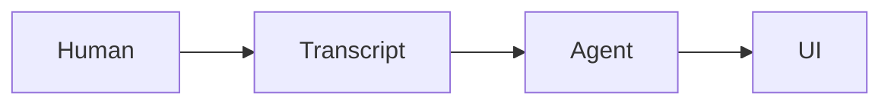

# Meeting

`meeting` is a local-first agentic meeting room.

Humans meet in a browser. Local Codex and Claude workers listen to transcript
events, raise a hand when useful, and can work in selected repositories after
the host grants permission.

## First Milestone

- P2P-ready meeting UI with transcript and agent side panel.
- Local API event bus.
- Local Whisper speech-to-text through `whisper.cpp`.
- Deepgram remains a fallback provider, not the agent brain.
- Local agent-worker scaffold for Codex or Claude subscription CLIs.
- MCP server so Claude Code / Codex can post Markdown, raise hands, set
  repository context, and create visible task cards.

## Setup

```bash
pnpm install
cp .env.example .env
pnpm dev
```

Open `http://localhost:5173`.

The app expects real local audio. There is no mock transcript loop in the
default product path.

## Local Whisper

Install `whisper.cpp` and the multilingual small model:

```bash
bash scripts/setup-whisper.cpp.sh
```

Then start the app:

```bash
pnpm dev
```

In the UI, click **Start Whisper** to send short microphone chunks to the local
API. The API converts browser audio with `ffmpeg` and invokes `whisper-cli`.

## MCP

Run the meeting MCP server:

```bash
MEETING_AGENT_ID=codex-ui pnpm dev:mcp
```

Smoke-test the MCP server against the running meeting API:

```bash
pnpm --filter @meeting/mcp-server smoke
```

Install the MCP server into local Codex and Claude Code configs:

```bash
bash scripts/install-mcp-clients.sh
```

Then restart Codex or Claude sessions so the new `meeting` tools are mounted in
the model context.

Tools:

- `meeting_raise_hand`
- `meeting_post_markdown`
- `meeting_set_repository`
- `meeting_create_task`

Agent output should usually be Markdown. Mermaid blocks render live:

````markdown

````

Example MCP client configuration:

```json
{
  "mcpServers": {
    "meeting": {
      "command": "pnpm",
      "args": ["--dir", "/Users/miguel_lemos/Desktop/mamba3/meeting", "--filter", "@meeting/mcp-server", "dev"],
      "env": {
        "MEETING_API_URL": "http://localhost:4317",
        "MEETING_ID": "local-demo",
        "MEETING_AGENT_ID": "codex-ui"
      }
    }
  }
}
```
