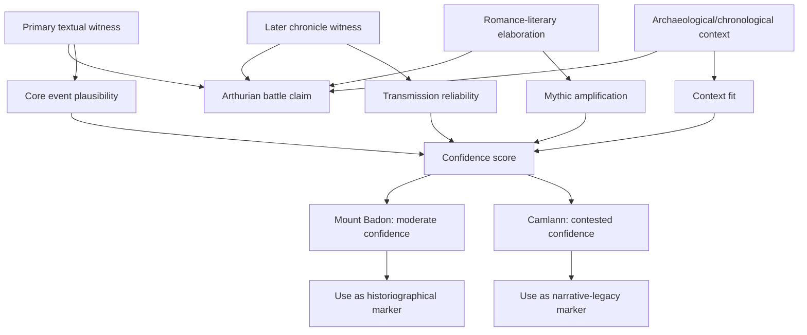

# Arthur and the Battles of Mount Badon and Camlann: Evidence Chain Map

This note adds a source-quality map for possible historical events often associated with Arthur.

## Scope and reliability framing

- **Goal:** distinguish *textual attestations* from *later literary expansion*.
- **Not a claim of certainty:** this keeps evidence as a chain with confidence levels.

## Mount Badon (often linked in tradition)

### Sources

- **Gildas, De Excidio Britanniae** (early, terse reference to a victory context, no named Arthur in surviving text traditions)
- **Bede** (later synthesis context)
- **Historia Brittonum** (later attributions)
- **Annales Cambriae** (medieval annal tradition)
- **Geoffrey of Monmouth** and later romance traditions

### Confidence reading

- **Core event memory:** **medium**
- **Attribution to Arthur specifically:** **low-to-medium**
- **Textual certainty:** variable across manuscripts and centuries

## Camlann (Arthur’s final battle motif)

### Sources

- **Annales Cambriae** (battle tradition)
- **Historia Brittonum / later chronicles and romances**
- **Arthurian literary cycles** (courtly and chivalric elaboration)

### Confidence reading

- **Core event memory:** **medium**
- **Narrative development (who fought whom, outcome details):** **low**
- **Legendic accretion risk:** **high**

## Battle evidence graph



## Practical interpretation

- Use these as **“evidence windows”**, not strict biography.
- Mount Badon is strongest as a *historical-memory anchor*.
- Camlann is strongest as a *tradition anchor*.
- Treat Arthur attributions as evolving over time.

## Excalidraw: evidence confidence map

```excalidraw
{
  "type": "excalidraw",
  "elements": [
    { "type": "rectangle", "x": 70, "y": 40, "width": 220, "height": 90, "strokeColor": "#0f766e", "backgroundColor": "#ecfeff", "label": { "text": "Primary text traces", "fontSize": 16 } },
    { "type": "rectangle", "x": 70, "y": 170, "width": 220, "height": 90, "strokeColor": "#1d4ed8", "backgroundColor": "#dbeafe", "label": { "text": "Chronicle layer", "fontSize": 16 } },
    { "type": "rectangle", "x": 70, "y": 300, "width": 220, "height": 90, "strokeColor": "#7c2d12", "backgroundColor": "#ffedd5", "label": { "text": "Romance-literary layer", "fontSize": 16 } },

    { "type": "rectangle", "x": 420, "y": 40, "width": 240, "height": 90, "strokeColor": "#14532d", "backgroundColor": "#dcfce7", "label": { "text": "Archaeological context", "fontSize": 16 } },
    { "type": "rectangle", "x": 420, "y": 170, "width": 240, "height": 90, "strokeColor": "#4c1d95", "backgroundColor": "#ede9fe", "label": { "text": "Scholarly chain synthesis", "fontSize": 16 } },
    { "type": "rectangle", "x": 420, "y": 300, "width": 240, "height": 90, "strokeColor": "#7f1d1d", "backgroundColor": "#fee2e2", "label": { "text": "Confidence outcome", "fontSize": 16 } },

    { "type": "rectangle", "x": 760, "y": 40, "width": 180, "height": 90, "strokeColor": "#0f172a", "backgroundColor": "#e2e8f0", "label": { "text": "Mount Badon", "fontSize": 16 } },
    { "type": "rectangle", "x": 760, "y": 170, "width": 180, "height": 90, "strokeColor": "#0f172a", "backgroundColor": "#e2e8f0", "label": { "text": "Camlann", "fontSize": 16 } },

    { "type": "arrow", "x": 294, "y": 80, "width": 120, "height": 0, "strokeColor": "#334155", "endArrowhead": "arrow", "label": { "text": "feeds", "fontSize": 12 } },
    { "type": "arrow", "x": 294, "y": 210, "width": 120, "height": 0, "strokeColor": "#334155", "endArrowhead": "arrow", "label": { "text": "feeds", "fontSize": 12 } },
    { "type": "arrow", "x": 294, "y": 340, "width": 120, "height": 0, "strokeColor": "#334155", "endArrowhead": "arrow", "label": { "text": "feeds", "fontSize": 12 } },

    { "type": "arrow", "x": 410, "y": 82, "width": 58, "height": 0, "strokeColor": "#334155", "endArrowhead": "arrow", "label": { "text": "context", "fontSize": 11 } },
    { "type": "arrow", "x": 670, "y": 80, "width": 82, "height": 0, "strokeColor": "#334155", "endArrowhead": "arrow", "label": { "text": "synthesize", "fontSize": 11 } },

    { "type": "arrow", "x": 410, "y": 212, "width": 58, "height": 0, "strokeColor": "#334155", "endArrowhead": "arrow", "label": { "text": "synthesize", "fontSize": 11 } },
    { "type": "arrow", "x": 670, "y": 212, "width": 82, "height": 0, "strokeColor": "#334155", "endArrowhead": "arrow", "label": { "text": "synthesize", "fontSize": 11 } },

    { "type": "arrow", "x": 410, "y": 342, "width": 58, "height": 0, "strokeColor": "#334155", "endArrowhead": "arrow", "label": { "text": "weight", "fontSize": 11 } },
    { "type": "arrow", "x": 660, "y": 342, "width": 92, "height": 0, "strokeColor": "#334155", "endArrowhead": "arrow", "label": { "text": "uncertainty", "fontSize": 11 } }
  ]
}
```
