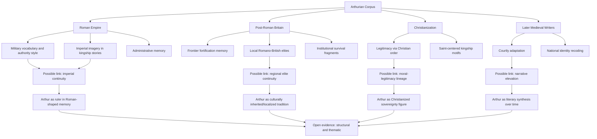

# King Arthur and the Romans: Relationship Map

I’m keeping this as a direct “possible relationships” diagram so the structure is clear without deleting anything.



```excalidraw
{
  "type": "excalidraw",
  "elements": [
    { "type": "ellipse", "x": 340, "y": 70, "width": 260, "height": 90, "strokeColor": "#1e40af", "backgroundColor": "#dbeafe", "label": { "text": "King Arthur", "fontSize": 20 } },

    { "type": "rectangle", "x": 60, "y": 70, "width": 200, "height": 80, "strokeColor": "#0f766e", "backgroundColor": "#ecfeff", "label": { "text": "Roman Empire", "fontSize": 16 } },
    { "type": "rectangle", "x": 60, "y": 190, "width": 200, "height": 80, "strokeColor": "#7c2d12", "backgroundColor": "#ffedd5", "label": { "text": "Post-Roman Britain", "fontSize": 16 } },
    { "type": "rectangle", "x": 60, "y": 310, "width": 200, "height": 80, "strokeColor": "#4c1d95", "backgroundColor": "#ede9fe", "label": { "text": "Christian World", "fontSize": 16 } },

    { "type": "rectangle", "x": 620, "y": 70, "width": 220, "height": 80, "strokeColor": "#14532d", "backgroundColor": "#dcfce7", "label": { "text": "Narrative continuity", "fontSize": 16 } },
    { "type": "rectangle", "x": 620, "y": 190, "width": 220, "height": 80, "strokeColor": "#7f1d1d", "backgroundColor": "#fee2e2", "label": { "text": "Narrative opposition", "fontSize": 16 } },
    { "type": "rectangle", "x": 620, "y": 310, "width": 220, "height": 80, "strokeColor": "#854d0e", "backgroundColor": "#fef3c7", "label": { "text": "Cultural inheritance", "fontSize": 16 } },

    { "type": "arrow", "x": 260, "y": 105, "width": 120, "height": 0, "strokeColor": "#334155", "endArrowhead": "arrow", "label": { "text": "influence", "fontSize": 12 } },
    { "type": "arrow", "x": 260, "y": 225, "width": 120, "height": 0, "strokeColor": "#334155", "endArrowhead": "arrow", "label": { "text": "continuity", "fontSize": 12 } },
    { "type": "arrow", "x": 260, "y": 345, "width": 120, "height": 0, "strokeColor": "#334155", "endArrowhead": "arrow", "label": { "text": "framing", "fontSize": 12 } },

    { "type": "arrow", "x": 560, "y": 105, "width": 60, "height": 0, "strokeColor": "#334155", "endArrowhead": "arrow", "label": { "text": "results", "fontSize": 12 } },
    { "type": "arrow", "x": 560, "y": 225, "width": 60, "height": 0, "strokeColor": "#334155", "endArrowhead": "arrow", "label": { "text": "results", "fontSize": 12 } },
    { "type": "arrow", "x": 560, "y": 345, "width": 60, "height": 0, "strokeColor": "#334155", "endArrowhead": "arrow", "label": { "text": "results", "fontSize": 12 } }
  ]
}
```
