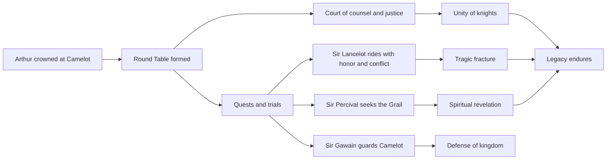

# Knights of King Arthur

A polished, narrative-rich overview of the Knights of King Arthur and the ideals that shaped Camelot.

## 1) Core figures

- **King Arthur** — the once and future king, ruler of Camelot and founder of the Round Table.
- **Merlin** — the wizard who helped bring Arthur to the throne and guided the kingdom.
- **Sir Lancelot** — renowned for martial skill, loyalty, and tragic emotional conflict.
- **Sir Gawain** — a symbol of honor, discipline, and duty.
- **Sir Percival** — the pure-hearted knight associated with the Quest for the Holy Grail.
- **Sir Galahad** — the paragon of purity and ultimate quest integrity.

## 2) Knights’ guiding values

1. **Honor** over convenience.
2. **Loyalty** to king, oath, and fellowship.
3. **Courage** in battle and in counsel.
4. **Compassion** for the vulnerable.
5. **Service** to Camelot’s peace and people.

## 3) The Round Table: what made it powerful

The Round Table was more than furniture: it was a governance model.

- No fixed “head” seat, representing shared merit.
- Debates and counsel in open exchange.
- Bonds across regions and lineages through common purpose.
- A mythic model of peer accountability.

## 4) The arc of legend

From Arthur’s coronation to the rise of Camelot, Arthurian legend cycles through:

- **Unity and rise**
- **Heroic quests** (including the Grail quest)
- **Intrigue and betrayal**
- **Fragmentation and reflection** on legacy

> The strongest stories are less about conquest and more about trying to *be worthy* of power.

## 5) Mermaid overview



## 6) Excalidraw sketch of the Arthurian constellation

```excalidraw
{
  "type": "excalidraw",
  "elements": [
    { "type": "rectangle", "x": 70, "y": 50, "width": 220, "height": 60, "strokeColor": "#1d4ed8", "backgroundColor": "#dbeafe", "label": { "text": "Arthur / Camelot", "fontSize": 20 } },
    { "type": "rectangle", "x": 380, "y": 50, "width": 300, "height": 60, "strokeColor": "#065f46", "backgroundColor": "#dcfce7", "label": { "text": "Round Table Fellowship", "fontSize": 18 } },
    { "type": "rectangle", "x": 760, "y": 50, "width": 260, "height": 60, "strokeColor": "#b91c1c", "backgroundColor": "#fee2e2", "label": { "text": "Quests & Grail Legend", "fontSize": 18 } },
    { "type": "arrow", "x": 290, "y": 80, "width": 90, "height": 0, "strokeColor": "#334155", "endArrowhead": "arrow", "label": { "text": "leads", "fontSize": 14 } },
    { "type": "arrow", "x": 690, "y": 80, "width": 70, "height": 0, "strokeColor": "#334155", "endArrowhead": "arrow", "label": { "text": "inspires", "fontSize": 14 } },
    { "type": "diamond", "x": 450, "y": 170, "width": 180, "height": 140, "strokeColor": "#0f172a", "backgroundColor": "#fef3c7", "label": { "text": "Chivalry", "fontSize": 20 } },
    { "type": "ellipse", "x": 130, "y": 230, "width": 120, "height": 90, "strokeColor": "#312e81", "backgroundColor": "#e0e7ff", "label": { "text": "Honor", "fontSize": 18 } },
    { "type": "ellipse", "x": 320, "y": 230, "width": 120, "height": 90, "strokeColor": "#14532d", "backgroundColor": "#dcfce7", "label": { "text": "Loyalty", "fontSize": 18 } },
    { "type": "ellipse", "x": 510, "y": 230, "width": 120, "height": 90, "strokeColor": "#7f1d1d", "backgroundColor": "#fee2e2", "label": { "text": "Courage", "fontSize": 18 } },
    { "type": "arrow", "x": 190, "y": 280, "width": 90, "height": 0, "strokeColor": "#0ea5e9", "endArrowhead": "arrow", "label": { "text": "embodies", "fontSize": 12 } },
    { "type": "arrow", "x": 440, "y": 275, "width": 70, "height": 0, "strokeColor": "#0284c7", "endArrowhead": "arrow", "label": { "text": "loyalty strengthens courage", "fontSize": 14 } },
    { "type": "arrow", "x": 470, "y": 280, "width": 90, "height": 0, "strokeColor": "#0ea5e9", "endArrowhead": "arrow", "label": { "text": "tests", "fontSize": 12 } }
  ]
}
```
