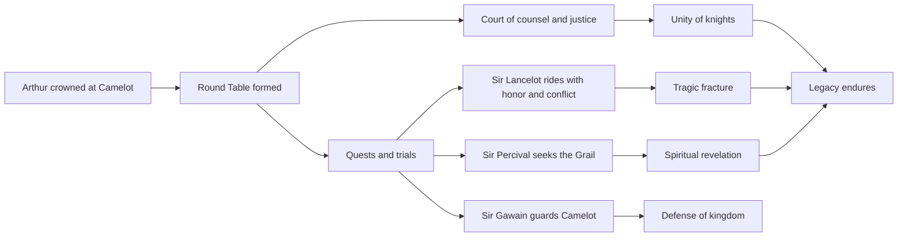
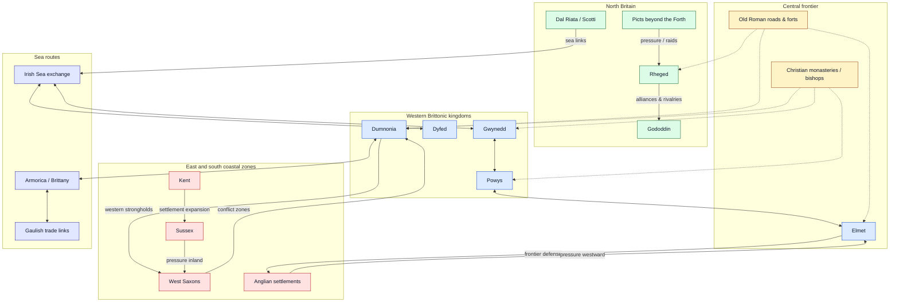

# Knights of King Arthur

A polished, narrative-rich overview of the Knights of King Arthur and the ideals that shaped Camelot.

## 1) Core figures

- **King Arthur** — the once and future king, ruler of Camelot and founder of the Round Table.
- **Merlin** — the wizard who helped bring Arthur to the throne and guided the kingdom.
- **Sir Lancelot** — renowned for martial skill, loyalty, and tragic emotional conflict.
- **Sir Gawain** — a symbol of honor, discipline, and duty.
- **Sir Percival** — the pure-hearted knight associated with the Quest for the Holy Grail.
- **Sir Galahad** — the paragon of purity and ultimate quest integrity.

## 2) Knights’ guiding values

1. **Honor** over convenience.
2. **Loyalty** to king, oath, and fellowship.
3. **Courage** in battle and in counsel.
4. **Compassion** for the vulnerable.
5. **Service** to Camelot’s peace and people.

## 3) The Round Table: what made it powerful

The Round Table was more than furniture: it was a governance model.

- No fixed “head” seat, representing shared merit.
- Debates and counsel in open exchange.
- Bonds across regions and lineages through common purpose.
- A mythic model of peer accountability.

## 4) The arc of legend

From Arthur’s coronation to the rise of Camelot, Arthurian legend cycles through:

- **Unity and rise**
- **Heroic quests** (including the Grail quest)
- **Intrigue and betrayal**
- **Fragmentation and reflection** on legacy

> The strongest stories are less about conquest and more about trying to *be worthy* of power.

## 5) Mermaid overview

## 6) Excalidraw sketch of the Arthurian constellation

<!-- generated-diagram-image: section=6 diagram=0 prompt=./artifact.smart.section-6.diagram-0.image-fix.prompt.md source=./artifact.smart.section-6.diagram-0.image-fix.source.md -->

## 7) Britain in the Arthurian age: regions and dynamics

A simplified map of the political landscape often associated with the post-Roman, early Arthurian setting: fragmented Brittonic kingdoms, expanding Anglo-Saxon settlements, northern powers, and older Roman infrastructure still shaping movement and defense.

