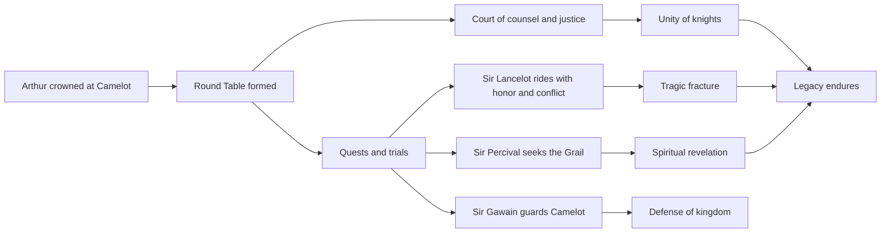
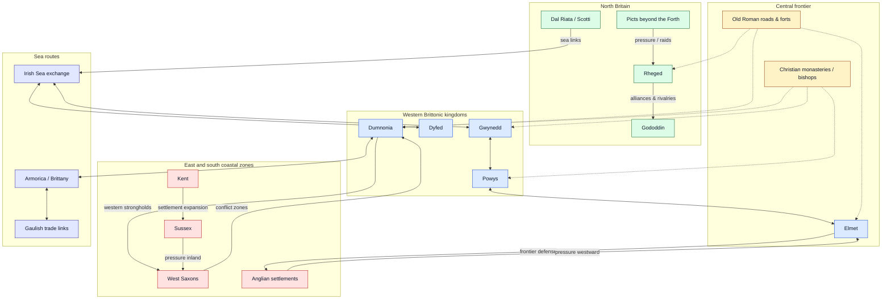
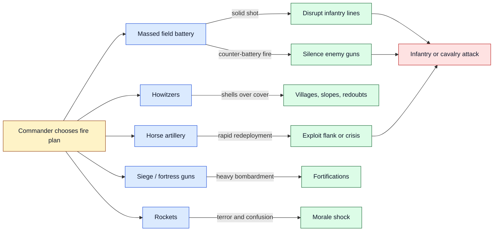
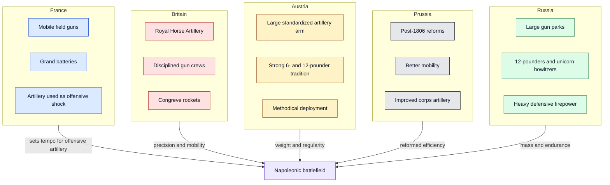

# Knights of King Arthur

A polished, narrative-rich overview of the Knights of King Arthur and the ideals that shaped Camelot.

## 1) Core figures

- **King Arthur** — the once and future king, ruler of Camelot and founder of the Round Table.
- **Merlin** — the wizard who helped bring Arthur to the throne and guided the kingdom.
- **Sir Lancelot** — renowned for martial skill, loyalty, and tragic emotional conflict.
- **Sir Gawain** — a symbol of honor, discipline, and duty.
- **Sir Percival** — the pure-hearted knight associated with the Quest for the Holy Grail.
- **Sir Galahad** — the paragon of purity and ultimate quest integrity.

## 2) Knights’ guiding values

1. **Honor** over convenience.
2. **Loyalty** to king, oath, and fellowship.
3. **Courage** in battle and in counsel.
4. **Compassion** for the vulnerable.
5. **Service** to Camelot’s peace and people.

## 3) The Round Table: what made it powerful

The Round Table was more than furniture: it was a governance model.

- No fixed “head” seat, representing shared merit.
- Debates and counsel in open exchange.
- Bonds across regions and lineages through common purpose.
- A mythic model of peer accountability.

## 4) The arc of legend

From Arthur’s coronation to the rise of Camelot, Arthurian legend cycles through:

- **Unity and rise**
- **Heroic quests** (including the Grail quest)
- **Intrigue and betrayal**
- **Fragmentation and reflection** on legacy

> The strongest stories are less about conquest and more about trying to *be worthy* of power.

## 5) Mermaid overview

## 6) Excalidraw sketch of the Arthurian constellation

<!-- generated-diagram-image: section=6 diagram=0 prompt=./artifact.smart.section-6.diagram-0.image-fix.prompt.md source=./artifact.smart.section-6.diagram-0.image-fix.source.md -->

## 7) Britain in the Arthurian age: regions and dynamics

A simplified map of the political landscape often associated with the post-Roman, early Arthurian setting: fragmented Brittonic kingdoms, expanding Anglo-Saxon settlements, northern powers, and older Roman infrastructure still shaping movement and defense.

## 8) Excalidraw sketch: local regions and pressures

A more spatial, hand-drawn-style version of the same regional dynamics: Brittonic west, Anglo-Saxon pressure from the east and south, northern kingdoms, sea routes, and inherited Roman infrastructure.

<!-- generated-diagram-image: section=8 diagram=0 prompt=./artifact.smart.section-8.diagram-0.image-fix.prompt.md source=./artifact.smart.section-8.diagram-0.image-fix.source.md -->

## 9) Napoleon and the Napoleonic Wars: artillery armament by country

Artillery was one of the decisive technologies of the Napoleonic Wars. Napoleon, trained as an artillery officer, used guns not merely as battlefield support but as a concentrated shock arm: massed batteries could break infantry formations, silence enemy guns, and open the way for cavalry or column assaults.

Across Europe, armies used broadly similar categories of weapons, but their organization, preferred calibres, mobility, and doctrine differed.

### Main artillery types

- **Field guns** — relatively mobile cannon firing solid shot, canister, and sometimes shell; used directly on battlefields.
- **Howitzers** — shorter-barrel weapons firing explosive shells in a higher arc, useful against troops behind cover or in villages.
- **Horse artillery** — light guns with mounted crews, designed to move rapidly with cavalry or respond to battlefield openings.
- **Siege and fortress artillery** — heavier cannon and mortars used against fortifications, cities, and prepared positions.
- **Rockets** — most famously British Congreve rockets: dramatic and frightening, but often inaccurate.

### Comparative overview

| Country / force | Typical artillery emphasis | Common armament examples | Battlefield character |
|---|---|---|---|
| **France** | Mobile field artillery and massed batteries | 4-, 6-, 8-, and 12-pounder guns; 6-inch howitzers | Flexible, aggressive, often concentrated at decisive points |
| **Britain** | Professional Royal Artillery, strong horse artillery, rockets | 6- and 9-pounder guns; 5.5-inch howitzers; Congreve rockets | Accurate, disciplined, often integrated with defensive infantry tactics |
| **Austria** | Large artillery arm with standardized systems | 3-, 6-, and 12-pounder guns; 7-pounder howitzers | Heavy and methodical; effective but sometimes less nimble |
| **Prussia** | Reformed after 1806; improved mobility and organization | 6- and 12-pounder guns; 7- and 10-pounder howitzers | Increasingly modernized, especially by 1813–1815 |
| **Russia** | Numerous guns, including powerful heavy field pieces | 6- and 12-pounder guns; unicorn howitzers | Massive batteries; strong defensive and attritional firepower |
| **Ottoman Empire / allies** | Mixed modern and older artillery traditions | Fortress guns, field cannon, imported models | Varied quality; often strongest in fixed positions |

### Diagram: artillery roles across the battlefield

### Diagram: national artillery profiles

### Why artillery mattered so much

Napoleonic infantry and cavalry still fought within the limits of black-powder weapons: smoke, slow reloads, short effective musket range, and imperfect communication. Artillery gave commanders a way to shape the battlefield before close combat began. The best armies learned to combine guns with infantry movement and cavalry timing rather than treating cannon as isolated weapons.

