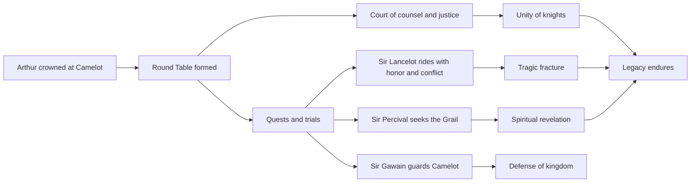
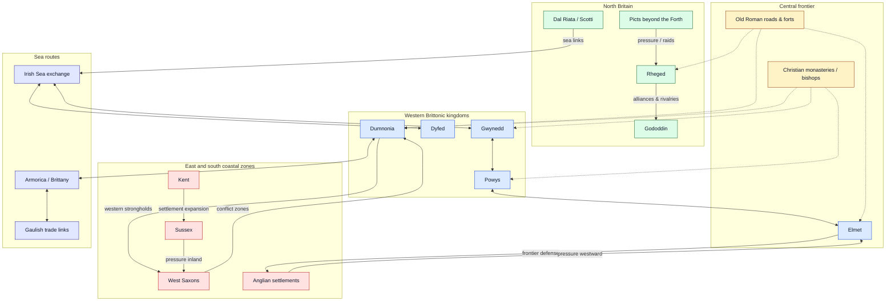

# Knights of King Arthur

A polished, narrative-rich overview of the Knights of King Arthur and the ideals that shaped Camelot.

## 1) Core figures

- **King Arthur** — the once and future king, ruler of Camelot and founder of the Round Table.
- **Merlin** — the wizard who helped bring Arthur to the throne and guided the kingdom.
- **Sir Lancelot** — renowned for martial skill, loyalty, and tragic emotional conflict.
- **Sir Gawain** — a symbol of honor, discipline, and duty.
- **Sir Percival** — the pure-hearted knight associated with the Quest for the Holy Grail.
- **Sir Galahad** — the paragon of purity and ultimate quest integrity.

## 2) Knights’ guiding values

1. **Honor** over convenience.
2. **Loyalty** to king, oath, and fellowship.
3. **Courage** in battle and in counsel.
4. **Compassion** for the vulnerable.
5. **Service** to Camelot’s peace and people.

## 3) The Round Table: what made it powerful

The Round Table was more than furniture: it was a governance model.

- No fixed “head” seat, representing shared merit.
- Debates and counsel in open exchange.
- Bonds across regions and lineages through common purpose.
- A mythic model of peer accountability.

## 4) The arc of legend

From Arthur’s coronation to the rise of Camelot, Arthurian legend cycles through:

- **Unity and rise**
- **Heroic quests** (including the Grail quest)
- **Intrigue and betrayal**
- **Fragmentation and reflection** on legacy

> The strongest stories are less about conquest and more about trying to *be worthy* of power.

## 5) Mermaid overview



## 6) Excalidraw sketch of the Arthurian constellation


<!-- generated-diagram-image: section=6 diagram=0 prompt=./artifact.smart.section-6.diagram-0.image-fix.prompt.md source=./artifact.smart.section-6.diagram-0.image-fix.source.md -->

## 7) Britain in the Arthurian age: regions and dynamics

A simplified map of the political landscape often associated with the post-Roman, early Arthurian setting: fragmented Brittonic kingdoms, expanding Anglo-Saxon settlements, northern powers, and older Roman infrastructure still shaping movement and defense.



## 8) Excalidraw sketch: local regions and pressures

A more spatial, hand-drawn-style version of the same regional dynamics: Brittonic west, Anglo-Saxon pressure from the east and south, northern kingdoms, sea routes, and inherited Roman infrastructure.

```excalidraw
{
  "type": "excalidraw",
  "elements": [
    { "type": "rectangle", "x": 40, "y": 40, "width": 1060, "height": 620, "strokeColor": "#475569", "backgroundColor": "#f8fafc", "label": { "text": "Britain after Rome: local regions and dynamics", "fontSize": 24 } },

    { "type": "ellipse", "x": 110, "y": 190, "width": 260, "height": 210, "strokeColor": "#1d4ed8", "backgroundColor": "#dbeafe", "label": { "text": "Western Brittonic kingdoms\nGwynedd • Powys • Dyfed", "fontSize": 18 } },
    { "type": "ellipse", "x": 190, "y": 430, "width": 220, "height": 130, "strokeColor": "#1d4ed8", "backgroundColor": "#bfdbfe", "label": { "text": "Dumnonia\nwestern strongholds", "fontSize": 17 } },

    { "type": "ellipse", "x": 430, "y": 250, "width": 220, "height": 150, "strokeColor": "#92400e", "backgroundColor": "#fef3c7", "label": { "text": "Central frontier\nElmet + old roads", "fontSize": 18 } },
    { "type": "rectangle", "x": 455, "y": 455, "width": 260, "height": 55, "strokeColor": "#92400e", "backgroundColor": "#fde68a", "label": { "text": "Roman roads and forts still channel movement", "fontSize": 15 } },

    { "type": "ellipse", "x": 740, "y": 210, "width": 260, "height": 190, "strokeColor": "#b91c1c", "backgroundColor": "#fee2e2", "label": { "text": "Anglo-Saxon coastal zones\nKent • Sussex • West Saxons", "fontSize": 18 } },
    { "type": "ellipse", "x": 450, "y": 70, "width": 260, "height": 120, "strokeColor": "#166534", "backgroundColor": "#dcfce7", "label": { "text": "Northern powers\nPicts • Rheged • Gododdin", "fontSize": 18 } },

    { "type": "rectangle", "x": 40, "y": 515, "width": 130, "height": 95, "strokeColor": "#3730a3", "backgroundColor": "#e0e7ff", "label": { "text": "Irish Sea\nexchange", "fontSize": 16 } },
    { "type": "rectangle", "x": 760, "y": 520, "width": 210, "height": 80, "strokeColor": "#3730a3", "backgroundColor": "#e0e7ff", "label": { "text": "Armorica / Brittany\nand Gaul links", "fontSize": 16 } },
    { "type": "rectangle", "x": 495, "y": 560, "width": 220, "height": 55, "strokeColor": "#065f46", "backgroundColor": "#d1fae5", "label": { "text": "Church networks: bishops and monasteries", "fontSize": 15 } },

    { "type": "arrow", "x": 740, "y": 305, "width": -95, "height": 0, "strokeColor": "#dc2626", "strokeWidth": 4, "endArrowhead": "arrow", "label": { "text": "pressure westward", "fontSize": 14 } },
    { "type": "arrow", "x": 430, "y": 320, "width": -60, "height": -25, "strokeColor": "#2563eb", "strokeWidth": 3, "endArrowhead": "arrow", "label": { "text": "alliances / rivalries", "fontSize": 14 } },
    { "type": "arrow", "x": 455, "y": 482, "width": -55, "height": -5, "strokeColor": "#92400e", "strokeWidth": 3, "endArrowhead": "arrow" },
    { "type": "arrow", "x": 650, "y": 330, "width": 90, "height": -20, "strokeColor": "#dc2626", "strokeWidth": 3, "endArrowhead": "arrow", "label": { "text": "frontier conflict", "fontSize": 14 } },
    { "type": "arrow", "x": 565, "y": 190, "width": 0, "height": 60, "strokeColor": "#166534", "strokeWidth": 3, "endArrowhead": "arrow", "label": { "text": "northern pressure", "fontSize": 14 } },
    { "type": "arrow", "x": 165, "y": 560, "width": 65, "height": -45, "strokeColor": "#3730a3", "strokeWidth": 3, "endArrowhead": "arrow", "label": { "text": "sea routes", "fontSize": 14 } },
    { "type": "arrow", "x": 410, "y": 500, "width": 350, "height": 45, "strokeColor": "#3730a3", "strokeWidth": 3, "endArrowhead": "arrow", "label": { "text": "trade and migration links", "fontSize": 14 } },
    { "type": "arrow", "x": 605, "y": 560, "width": -250, "height": -190, "strokeColor": "#059669", "strokeWidth": 2, "endArrowhead": "arrow", "label": { "text": "Christian influence", "fontSize": 14 } }
  ]
}
```

