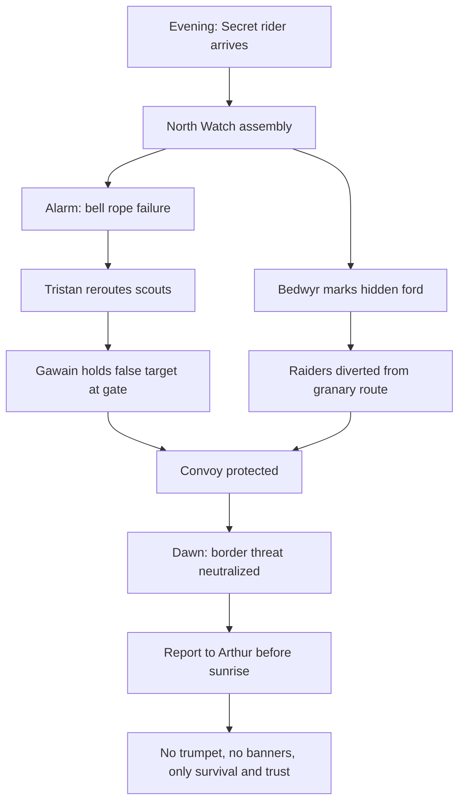

# The Night the Bells Fell Silent

One stormy autumn night in Camelot, a single night changed everything.

King Arthur had just returned from court when a rider arrived without the ceremony of horn or banner. Only rain and urgency. Merlyn’s seal was on the wax: **“meet at the North Watch before moonrise.”**

By dusk, three riders waited in secret at the gate: Sir Gawain, Sir Tristan, and Lady Bedwyr. The watchfire in the outer court burned low as if trying not to be seen.

## The Story

At the northern wall, a silent bell rope snapped in the wind. Inside the armory, the keep’s bells were struck at midnight, not for bells but for a warning.

- **Sir Gawain** kept watch and listened for distant hooves.
- **Sir Tristan** decoded the rider’s token and confirmed the threat was from the eastern marshes.
- **Bedwyr** prepared a hidden path map and a reserve lantern, knowing no one else should see it.

By the first watch, they learned that a faction from beyond the border had crossed hidden routes and planned to ambush the granary convoy. No grand victory was possible; only prevention, in the dark and under pressure.

Arthur arrived unarmored, carrying no crown—only a cloak, a blade, and a single question:

> “Can this be stopped before first light?”

It was answered not with speeches, but with coordinated motion:

1. Tristan rode south to reroute the scouts.
2. Bedwyr mapped a fordless crossing and marked safe stones.
3. Gawain stood the gate with a handful of men, drawing attention toward the wrong tower.

By dawn, the granary was safe, the raiders confused, and Camelot still sleeping.

No one called it victory. They called it a night they might not have survived if they had failed to move together.

## Mermaid timeline of the night



## Diagram of the night watch (cast and intent)

```excalidraw
{
  "type": "excalidraw",
  "elements": [
    { "type": "ellipse", "x": 120, "y": 90, "width": 180, "height": 90, "strokeColor": "#111827", "backgroundColor": "#dbeafe", "label": { "text": "King Arthur", "fontSize": 18 } },
    { "type": "rectangle", "x": 360, "y": 80, "width": 190, "height": 70, "strokeColor": "#1d4ed8", "backgroundColor": "#dbeafe", "label": { "text": "North Watch", "fontSize": 17 } },
    { "type": "rectangle", "x": 610, "y": 80, "width": 170, "height": 70, "strokeColor": "#0f766e", "backgroundColor": "#ecfeff", "label": { "text": "Armory Signals", "fontSize": 16 } },
    { "type": "rectangle", "x": 360, "y": 190, "width": 190, "height": 70, "strokeColor": "#166534", "backgroundColor": "#dcfce7", "label": { "text": "Gate Diversion", "fontSize": 16 } },
    { "type": "rectangle", "x": 610, "y": 190, "width": 170, "height": 70, "strokeColor": "#7c2d12", "backgroundColor": "#fee2e2", "label": { "text": "Scouts Redirected", "fontSize": 16 } },
    { "type": "arrow", "x": 260, "y": 130, "width": 90, "height": 0, "strokeColor": #334155, "endArrowhead": "arrow", "label": { "text": "orders", "fontSize": 13 } },
    { "type": "arrow", "x": 470, "y": 130, "width": 140, "height": 0, "strokeColor": #334155, "endArrowhead": "arrow", "label": { "text": "alert signal", "fontSize": 13 } },
    { "type": "arrow", "x": 455, "y": 160, "width": 0, "height": 30, "strokeColor": #334155, "endArrowhead": "arrow", "label": { "text": "to gates", "fontSize": 13 } },
    { "type": "arrow", "x": 690, "y": 160, "width": 0, "height": 40, "strokeColor": #334155, "endArrowhead": "arrow", "label": { "text": "re-route", "fontSize": 13 } },
    { "type": "diamond", "x": 300, "y": 300, "width": 330, "height": 90, "strokeColor": "#713f12", "backgroundColor": "#fef3c7", "label": { "text": "Outcome: Dawn holds, convoy saved", "fontSize": 16 } }
  ]
}
```

## Cast notes from that night

- **Arthur**: chose discretion over ceremony.
- **Gawain**: drew eyes to the gate.
- **Tristan**: cut the raider line before contact.
- **Bedwyr**: turned geography into strategy.

A single night in Camelot proved that silence can be louder than horns when everyone knows their role.
