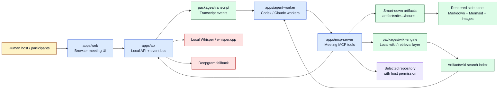
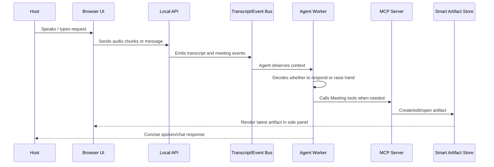
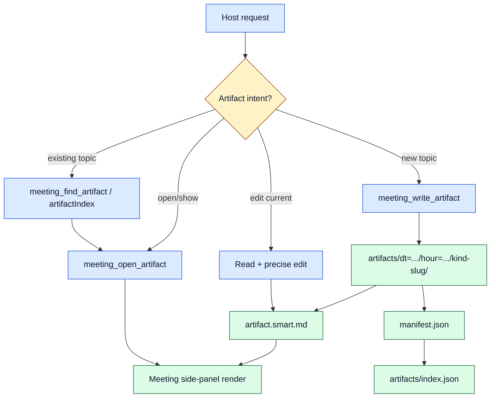

# Meeting Project Architecture

`meeting` is a **local-first agentic meeting room**. Humans meet in a browser, speech becomes transcript events, local agents observe the event stream, and approved tools let agents create artifacts, render diagrams, search the local wiki, and work in repositories.

## 1) System at a glance



## 2) Main workspace components

| Area | Path | Role |
|---|---|---|
| Web UI | `apps/web` | Browser meeting room, transcript display, artifact rendering side panel |
| Local API | `apps/api` | Local event bus, speech endpoints, server-side coordination |
| Agent worker | `apps/agent-worker` | Local Codex/Claude-style workers that listen and act when useful |
| MCP server | `apps/mcp-server` | Tool bridge exposed to coding agents and assistants |
| Protocol package | `packages/protocol` | Shared event/tool contracts between apps |
| Transcript package | `packages/transcript` | Transcript data structures and speech-event handling |
| Wiki engine | `packages/wiki-engine` | Local-first memory layer, search, parent/child traversal |
| Artifacts | `artifacts/dt=YYYY-MM-DD/hour=HH/...` | Durable smart Markdown outputs with manifests |
| Scripts | `scripts/` | Dev, daemon, screenshot, artifact, and rendering utilities |

## 3) Runtime conversation loop



## 4) Artifact lifecycle

Smart-down artifacts are durable Markdown documents. One folder represents one evolving idea; normal iterations edit the same `artifact.smart.md` rather than creating `v2` files.



## 5) Retrieval and wiki architecture

The project uses two related memory ideas:

1. **Artifacts** — polished, durable outputs with `manifest.json` metadata and a generated index.
2. **Wiki engine** — a local-first graph of pages with parent/child references, compact summaries, keywords, and deterministic traversal.

```mermaid
flowchart LR
  Query[User asks for something] --> Candidates[Ranked candidates\nartifactIndex + search]
  Candidates --> Intent[Intent router\nopen / edit / create / chat]
  Intent --> Existing[Open or edit existing artifact]
  Intent --> New[Create separate artifact]

  Raw[raw documents] --> Extract[Extract title, summary, keywords, entities]
  Extract --> Parent[Choose parent page\noptional LLM arbitration]
  Parent --> Page[Generated wiki page]
  Page --> Backlink[Parent menu/backlink update]
  Backlink --> Traverse[Numbered traversal\n[0] parent, [1..n] children]

  Page --> Candidates
  Existing --> Render[Rendered answer/artifact]
  New --> Render

  classDef query fill:#fef3c7,stroke:#92400e,color:#0f172a;
  classDef process fill:#dbeafe,stroke:#1d4ed8,color:#0f172a;
  classDef memory fill:#dcfce7,stroke:#166534,color:#0f172a;
  classDef output fill:#ede9fe,stroke:#6d28d9,color:#0f172a;

  class Query,Intent query;
  class Candidates,Extract,Parent,Backlink process;
  class Raw,Page,Traverse memory;
  class Existing,New,Render output;
```

## 6) Tooling surface

The assistant-facing tools map closely onto project operations:

- **Create artifact**: `meeting_write_artifact`
- **Find artifact**: `meeting_find_artifact`
- **Open artifact**: `meeting_open_artifact`
- **Inspect render**: `meeting_inspect_artifact`
- **Queue visual review**: `meeting_queue_visual_review`
- **Promote diagram image**: `meeting_promote_diagram_image`
- **File-level work**: read/edit/write/bash inside the repository

## 7) Design principles

- **Local-first**: core meeting, transcript, artifact, and wiki flows run locally.
- **Durable memory**: artifacts and wiki pages are files, not hidden chat state.
- **Human permission boundary**: agents can observe, propose, and act through approved tools.
- **Renderable by default**: Markdown, Mermaid, and promoted images keep outputs visible.
- **Iterate in place**: existing artifacts evolve; Git history provides versioning.

## 8) Current strength and next improvement

The strongest part of the architecture is the loop from **conversation → intent → tool call → durable artifact → rendered UI**.

The next improvement would be stronger retrieval ergonomics: better fuzzy names, aliases like “the Napoleon one,” snippets in candidate results, and explicit clarification when confidence is low.
