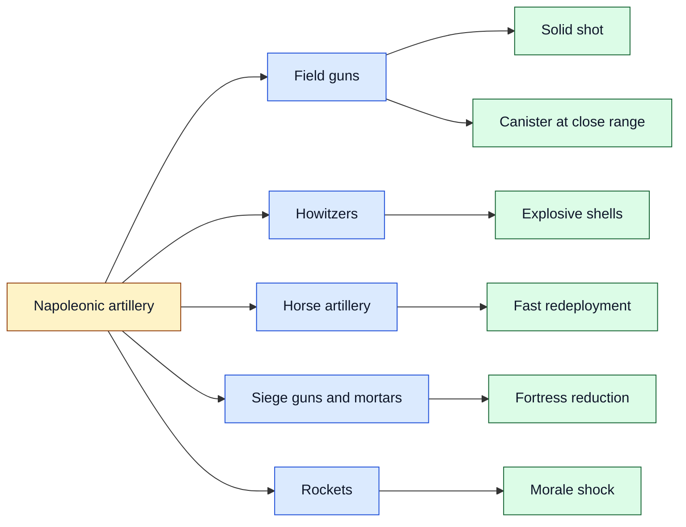
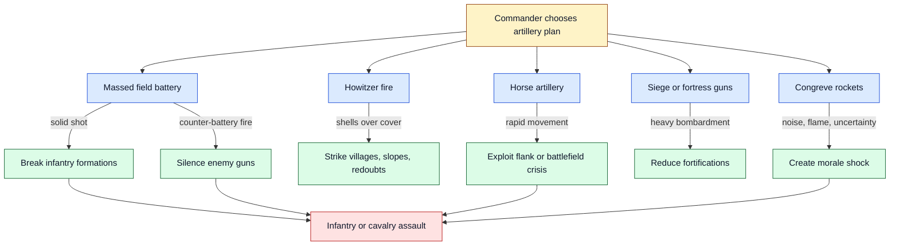
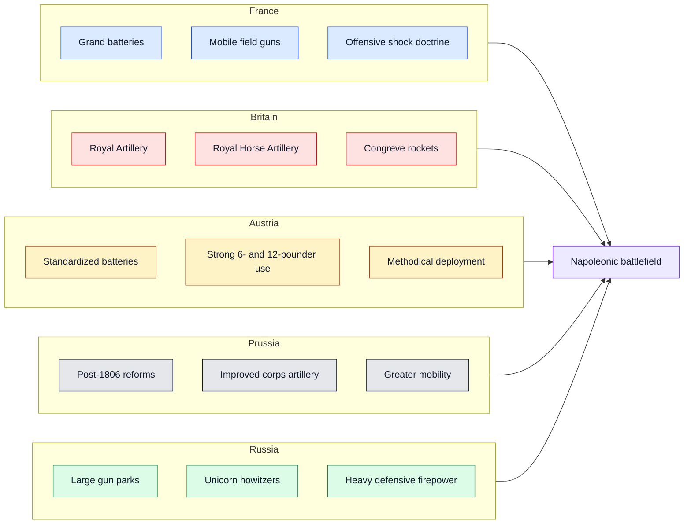

# Napoleonic Artillery Armament Across Europe

Artillery was one of the decisive arms of the Napoleonic Wars. Napoleon had been trained as an artillery officer, and he understood cannon not merely as support weapons but as instruments for shaping the entire battlefield: breaking infantry lines, silencing enemy guns, creating breaches, and preparing decisive attacks.

This document compares the main artillery types used by France, Britain, Austria, Prussia, Russia, and other European forces during the period.

## 1) Main types of artillery

- **Field guns** — mobile battlefield cannon firing solid shot, canister, and sometimes shell.
- **Howitzers** — shorter-barrel weapons firing explosive shells in a higher arc.
- **Horse artillery** — lighter guns with mounted crews, designed for rapid movement.
- **Siege artillery** — heavy cannon and mortars used against fortifications.
- **Rockets** — especially British Congreve rockets; terrifying but often inaccurate.

## 2) Comparative armament by country

| Country / force | Common artillery armament | Distinctive character |
|---|---|---|
| **France** | 4-, 6-, 8-, and 12-pounder guns; 6-inch howitzers | Mobile, aggressive, often concentrated in grand batteries |
| **Britain** | 6- and 9-pounder guns; 5.5-inch howitzers; Congreve rockets | Professional crews, strong horse artillery, disciplined fire |
| **Austria** | 3-, 6-, and 12-pounder guns; 7-pounder howitzers | Large, standardized, methodical artillery arm |
| **Prussia** | 6- and 12-pounder guns; 7- and 10-pounder howitzers | Reformed after 1806, increasingly mobile and efficient |
| **Russia** | 6- and 12-pounder guns; unicorn howitzers | Heavy batteries, strong defensive firepower, many guns |
| **Ottoman Empire / allied forces** | Mixed field, fortress, and imported artillery models | Varied quality; often strongest in fixed or fortified positions |

## 3) Battlefield roles

Artillery worked best when coordinated with infantry and cavalry. A commander could use guns to weaken a target, force enemy movement, disrupt morale, or create the exact opening needed for an assault.

## 4) National artillery profiles

## 5) Why Napoleon cared so much about artillery

Napoleonic warfare relied on timing. Muskets were short-ranged and slow to reload, cavalry needed openings, and infantry assaults could collapse under disciplined fire. Artillery helped solve these problems by damaging formations before contact and forcing the enemy to react.

The French often used **massed batteries** to concentrate fire at a decisive point. Britain leaned heavily on professional gunnery and horse artillery. Russia relied on large numbers of guns and powerful defensive batteries. Austria and Prussia, especially after reforms, tried to balance standardization, mobility, and firepower.

In short: artillery was the battlefield lever that turned movement into decision.
