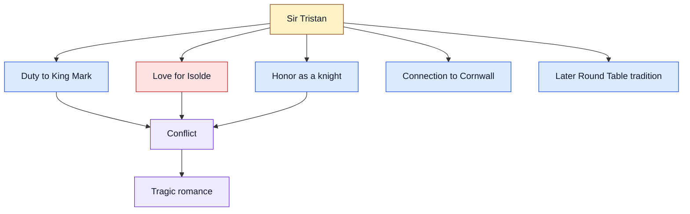

# Sir Tristan and His Older Legends

Sir Tristan is one of the most famous knights connected to King Arthur’s world, though his story likely grew from older Celtic and medieval romance traditions before being fully absorbed into the Arthurian cycle.

He is best known for the tragic love story of **Tristan and Isolde**: a tale of loyalty, courtly love, exile, skill at arms, and impossible emotional conflict.

## 1) Who was Sir Tristan?

- **Sir Tristan** — a knight of Cornwall, often portrayed as noble, musical, brave, and doomed by love.
- **King Mark of Cornwall** — Tristan’s uncle and lord, whose marriage to Isolde creates the central conflict.
- **Isolde / Iseult** — an Irish princess and healer; Tristan’s beloved in many versions.
- **King Arthur’s court** — in later romances, Tristan becomes one of the great knights associated with the Round Table.

## 2) The core story

Tristan is sent to Ireland to bring back Isolde as bride for King Mark. During the journey, Tristan and Isolde accidentally drink a love potion meant for Isolde and Mark. From that moment, their loyalty to king, kin, and social order is set against an overwhelming bond of love.

The story becomes tragic because neither duty nor love can fully win without destroying the other.

## 3) Older roots of the legend

The Tristan story appears to draw on several older layers:

| Layer | Contribution to the Tristan legend |
|---|---|
| **Celtic heroic material** | Cornwall, Ireland, exile, sea-crossings, warrior identity |
| **Courtly romance** | Refined love, secrecy, emotional conflict, poetic suffering |
| **Arthurian expansion** | Tristan becomes a Round Table knight and peer of Lancelot |
| **Medieval moral drama** | The tension between oath, marriage, kingship, and desire |

## 4) Diagram: Tristan’s conflicting loyalties

## 5) Why Tristan matters

Tristan is important because he shows a different side of Arthurian legend. Where many knights are tested by monsters, quests, or battlefield courage, Tristan is tested by emotional contradiction. He is both loyal and disloyal, noble and transgressive, heroic and doomed.

That complexity made him one of the great figures of medieval romance, standing beside Lancelot as an example of how love could both ennoble and destroy a knight.
