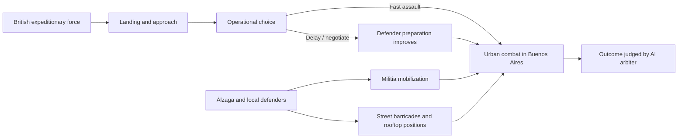
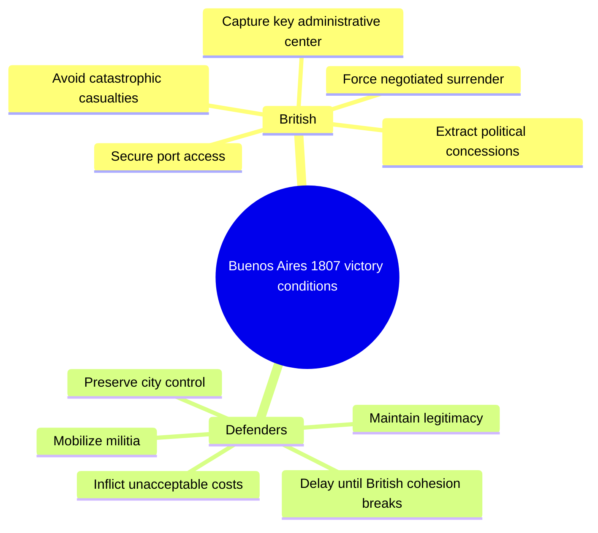
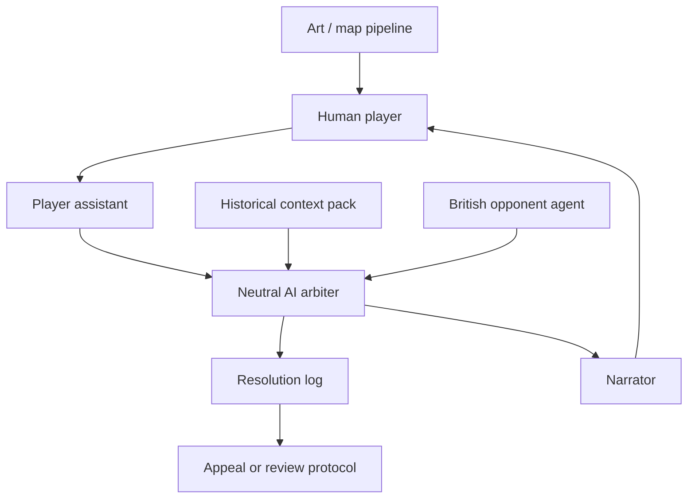

# Buenos Aires 1807 Wargame Test

## What we did

We used the **British invasion of Buenos Aires in 1807** as a live test case for an AI-arbitrated historical wargame.

The user explored the scenario mainly from the defensive Buenos Aires side, especially around **Martín de Álzaga**, urban preparation, local militia, and the political-military structure of the city. The AI acted as narrator, opponent, arbiter, and historical assistant during the experiment.

## Core scenario



## Main conclusion

The scenario is probably **not well balanced if British victory requires taking a fully prepared Buenos Aires by direct urban assault**.

Once the defenders are mobilized, supplied, and organized inside the city, the British player is pushed into a very difficult fight. The more realistic strategic question is not simply “Can Britain win the street battle?” but:

> Can the British force create favorable political, logistical, or timing conditions before the city becomes impossible to storm?

## Design lesson

Buenos Aires 1807 works better as a **campaign or operational scenario** than as a simple tactical battle.

Better starting points might be:

1. Before the British landing.
2. During the approach to the city.
3. Before local militia and barricades are fully organized.
4. With political negotiation and morale as major mechanics.
5. With British victory conditions broader than total conquest.

## Victory condition ideas



## AI arbiter lesson

This test showed why the AI arbiter needs a stable protocol. The arbiter should not simply reward the player who argues harder.

Before resolving actions, the arbiter should define:

- Historical facts in force.
- Available troops and supplies.
- Time scale.
- Morale and political legitimacy.
- Terrain and urban constraints.
- Uncertainty and fog of war.
- Criteria for success, partial success, and failure.

## Role separation lesson

The same AI should probably not be all of these at once:

- Neutral arbiter.
- British player.
- Spanish/Buenos Aires assistant.
- Historian/source curator.
- Narrator.
- Art director.

A stronger system would separate those roles into different agents or modes.

## Diagram of improved architecture



## Historical artwork generated

We also generated a raster illustration for the scenario: an alternate-history oil-painting-style view of fortified Buenos Aires in 1807, with local defenders organized in the city and British troops halted near the Río de la Plata.

Generated image path:

```text
.pi/generated/019e32fe-bbd9-728c-8771-e349a4ae0586/ig_06761df0aa7aa253016a09299e3f70819386cb6dec671cc9d5.png
```

## Quick takeaway

Buenos Aires 1807 is a very useful test scenario because it exposes exactly what the wargame system must handle:

- Asymmetric objectives.
- Urban warfare.
- Political legitimacy.
- Militia mobilization.
- Timing and preparation.
- The difference between tactical bravery and strategic feasibility.

It is less useful as a perfectly balanced head-to-head battle unless the start date, objectives, or British options are redesigned.
