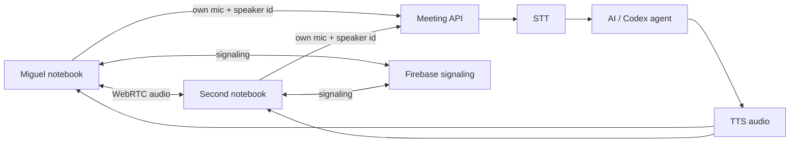

# Multi-human Meeting over WebRTC

This is the initial setup plan for letting a second notebook join the same Meeting.

## Target experience

Each participant opens the Meeting web page, joins a room, and gets:

- Their own microphone capture.
- Direct human-to-human audio over WebRTC.
- Speaker attribution from the client identity, not diarization.
- The same AI assistant audio played back to everyone.
- The same transcript/canvas/event stream.

## Architecture



## Why attribution is simple

For the normal case, each human uses a separate browser/device. That means the stream itself identifies the speaker:

- Miguel's browser sends audio as `speakerId=miguel`.
- The other notebook sends audio as `speakerId=<their name>`.

No hard diarization is needed unless multiple people share one microphone.

## Public lobby / meeting discovery

GitHub Pages should be the public entry point where people can find meetings.

The first version should show a simple lobby:

- Online meetings.
- Host display name.
- Room title.
- Whether the room is public or invite-only.
- Participant count.
- Last heartbeat / freshness.
- Join button that opens the guest client with the selected host API/signaling room.

Firebase can store this presence registry separately from the WebRTC signaling messages.

```text
publicMeetings/{meetingId}
  title: string
  host: { id, name }
  apiUrl: string
  signalingRoomId: string
  visibility: public | invite-only
  participantCount: number
  updatedAt: server timestamp
```

Hosts publish a heartbeat while their backend is online. Guests subscribe to `publicMeetings` and only show rooms whose `updatedAt` is recent enough, for example less than 30 seconds old.

This preserves the host/guest architecture while still making GitHub Pages the shared discovery place.

## Correct objective: Peer/WebRTC + Firebase signaling

The intended architecture is **not** “guests call the host API over ngrok as the primary path.” The intended architecture is:

1. GitHub Pages is the public lobby.
2. Firebase Realtime Database advertises online meetings and carries signaling messages.
3. Browsers connect to each other with WebRTC peer connections.
4. The host browser receives guest audio over WebRTC.
5. The host browser forwards the relevant audio/transcript work to the local host API/model stack.

That means Firebase is enough for discovery/signaling. A public tunnel is only a temporary fallback for direct API access, not the target multi-human design.

The first implementation scaffold uses raw `RTCPeerConnection` with a Firebase signaling adapter. A PeerJS-style wrapper can sit above the same conceptual layer, but PeerJS's default cloud broker is not required if Firebase is the signaling transport.

Code added:

```text
apps/web/src/multi-human-room.ts
apps/web/src/firebase-signaling.ts
```

## Signaling

WebRTC peers need a side channel to find each other and exchange:

- Room membership.
- Offers.
- Answers.
- ICE candidates.
- Presence / disconnect events.

Firebase Realtime Database is the signaling side channel. Signals are namespaced so the database root stays clean:

```text
gauchoai-meeting/signalingRooms/{roomId}/signals/{autoId}
```

Firebase is a good fit for this because it provides realtime pub/sub without running a custom signaling server.

## Initial code scaffold

The first reusable browser-side WebRTC scaffold is in:

```text
apps/web/src/multi-human-room.ts
```

It defines:

- `MultiHumanRoom`
- `MeetingSignalingAdapter`
- `MeetingSignal`
- `MeetingPeer`

The class is signaling-backend agnostic. The next step is to add a Firebase implementation of `MeetingSignalingAdapter` and wire it into the Meeting UI behind a feature flag.

## GitHub Pages caveat

GitHub Pages can host the static web client, but it cannot by itself run the Meeting API, local STT, local TTS, or Codex/pi agent process.

So there are two likely modes:

1. **Same LAN development mode**
   - Run the API and web app on the main machine.
   - Open the web page from the second notebook using the main machine's LAN IP.
   - Use Firebase only for WebRTC peer signaling.

2. **Public hosted client mode**
   - Host the static client on GitHub Pages.
   - Point it at a public Meeting API endpoint or a tunnel to the host machine.
   - Use Firebase for signaling.

## Next implementation steps

1. Add Firebase project configuration via environment variables.
2. Implement a Firebase public meeting registry / lobby.
3. Wire `FirebaseRealtimeSignalingAdapter` into the lobby/stable shell join flow.
4. Add a small room UI: room id, display name, join/leave.
5. Attach remote peer audio elements.
6. In host mode, forward guest WebRTC audio from the host browser to the local Meeting API with the guest speaker label.
7. Broadcast AI TTS playback to all clients, or send TTS/audio events over WebRTC data/media channels.
8. Add cleanup for stale Firebase room/signaling documents.

## Minimal Firebase data shape

```text
rooms/{roomId}/signals/{autoId}
  type: hello | bye | offer | answer | ice
  from: { id, name }
  to: peerId or null
  sdp: object, for offer/answer
  candidate: object, for ice
  createdAt: server timestamp
```

The web client subscribes to recent `signals` for its room and ignores messages from itself.
