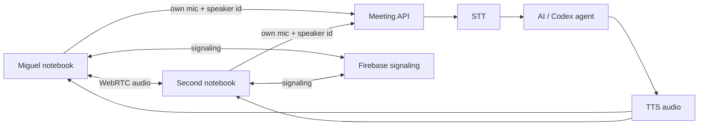

# Multi-human Meeting over WebRTC

This is the initial setup plan for letting a second notebook join the same Meeting.

## Target experience

Each participant opens the Meeting web page, joins a room, and gets:

- Their own microphone capture.
- Direct human-to-human audio over WebRTC.
- Speaker attribution from the client identity, not diarization.
- The same AI assistant audio played back to everyone.
- The same transcript/canvas/event stream.

## Architecture



## Why attribution is simple

For the normal case, each human uses a separate browser/device. That means the stream itself identifies the speaker:

- Miguel's browser sends audio as `speakerId=miguel`.
- The other notebook sends audio as `speakerId=<their name>`.

No hard diarization is needed unless multiple people share one microphone.

## Signaling

WebRTC peers need a side channel to find each other and exchange:

- Room membership.
- Offers.
- Answers.
- ICE candidates.
- Presence / disconnect events.

Firebase is a good fit for this because it can provide a small realtime database or Firestore collection for room signaling without running a custom signaling server.

## Initial code scaffold

The first reusable browser-side WebRTC scaffold is in:

```text
apps/web/src/multi-human-room.ts
```

It defines:

- `MultiHumanRoom`
- `MeetingSignalingAdapter`
- `MeetingSignal`
- `MeetingPeer`

The class is signaling-backend agnostic. The next step is to add a Firebase implementation of `MeetingSignalingAdapter` and wire it into the Meeting UI behind a feature flag.

## GitHub Pages caveat

GitHub Pages can host the static web client, but it cannot by itself run the Meeting API, local STT, local TTS, or Codex/pi agent process.

So there are two likely modes:

1. **Same LAN development mode**
   - Run the API and web app on the main machine.
   - Open the web page from the second notebook using the main machine's LAN IP.
   - Use Firebase only for WebRTC peer signaling.

2. **Public hosted client mode**
   - Host the static client on GitHub Pages.
   - Point it at a public Meeting API endpoint or a tunnel to the host machine.
   - Use Firebase for signaling.

## Next implementation steps

1. Add Firebase project configuration via environment variables.
2. Implement `FirebaseMeetingSignalingAdapter`.
3. Add a small room UI: room id, display name, join/leave.
4. Attach remote peer audio elements.
5. Send each client's own mic to the Meeting API with that client's speaker label.
6. Broadcast AI TTS playback to all clients, or let every client subscribe to the same TTS/event stream.
7. Add cleanup for stale Firebase room documents.

## Minimal Firebase data shape

```text
rooms/{roomId}/signals/{autoId}
  type: hello | bye | offer | answer | ice
  from: { id, name }
  to: peerId or null
  sdp: object, for offer/answer
  candidate: object, for ice
  createdAt: server timestamp
```

The web client subscribes to recent `signals` for its room and ignores messages from itself.
