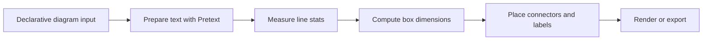

# Rendering Architecture

The meeting canvas is optimized for generated, declarative documents: Markdown, Mermaid, Excalidraw-compatible scenes, and future first-class diagram blocks.

## Cornerstone: text measurement before drawing

Generated diagrams should not guess whether text fits. Before a shape is rendered, labels must be measured, wrapped, and sized from font metrics.

We use [`@chenglou/pretext`](https://www.npmjs.com/package/@chenglou/pretext) as the text-layout foundation.

Why Pretext:

- accurate multiline text measurement and layout
- line count, height, and widest-line width before render
- Unicode/grapheme-aware segmentation
- avoids DOM reflow measurement loops
- suitable for Canvas/SVG/manual renderers
- supports declarative generated UI where boxes must fit labels deterministically

## Intended flow



## Basic sizing pattern

```ts
import { prepareWithSegments, measureLineStats } from "@chenglou/pretext";

const font = '18px Virgil, ui-sans-serif, system-ui';
const lineHeight = 24;
const paddingX = 32;
const paddingY = 24;
const maxTextWidth = 280;

const prepared = prepareWithSegments(label, font, { whiteSpace: "normal" });
const stats = measureLineStats(prepared, maxTextWidth);

const width = Math.ceil(stats.maxLineWidth + paddingX * 2);
const height = Math.ceil(stats.lineCount * lineHeight + paddingY * 2);
```

## Compatibility goal

We should preserve the full declarative expressiveness of Excalidraw-compatible scene JSON:

- rectangles, diamonds, ellipses, text, arrows, lines
- labels and arrow labels
- stroke/background colors
- rough/sketch styling where possible
- groups and future metadata

But generated diagrams should prefer our measurement-first layer when they need guarantees that text fits.

## Current policy

- Excalidraw normalization is behind a flag and defaults off.
- Pretext is the preferred foundation for the next sizing/layout pass.
- Avoid hand-rolled character-width estimates for production diagram layout.

## Next steps

1. Replace heuristic label measurement with Pretext.
2. Add a small `measureLabel()` helper shared by diagram renderers.
3. Use measured line stats to size boxes and arrow labels.
4. Keep raw Excalidraw rendering available for authored scenes.
5. Add visual regression screenshots for normalization on/off and Pretext sizing.
