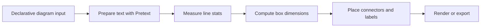

# Rendering Architecture

The meeting canvas is optimized for generated, declarative documents: Markdown, Mermaid, Excalidraw-compatible scenes, and future first-class diagram blocks.

## Cornerstone: text measurement before drawing

Generated diagrams should not guess whether text fits. Before a shape is rendered, labels must be measured, wrapped, and sized from font metrics.

We use [`@chenglou/pretext`](https://www.npmjs.com/package/@chenglou/pretext) as the text-layout foundation.

Why Pretext:

- accurate multiline text measurement and layout
- line count, height, and widest-line width before render
- Unicode/grapheme-aware segmentation
- avoids DOM reflow measurement loops
- suitable for Canvas/SVG/manual renderers
- supports declarative generated UI where boxes must fit labels deterministically

## Intended flow



## Basic sizing pattern

```ts
import { prepareWithSegments, measureLineStats } from "@chenglou/pretext";

const font = '18px Virgil, ui-sans-serif, system-ui';
const lineHeight = 24;
const paddingX = 32;
const paddingY = 24;
const maxTextWidth = 280;

const prepared = prepareWithSegments(label, font, { whiteSpace: "normal" });
const stats = measureLineStats(prepared, maxTextWidth);

const width = Math.ceil(stats.maxLineWidth + paddingX * 2);
const height = Math.ceil(stats.lineCount * lineHeight + paddingY * 2);
```

## Compatibility goal

We should preserve the full declarative expressiveness of Excalidraw-compatible scene JSON:

- rectangles, diamonds, ellipses, text, arrows, lines
- labels and arrow labels
- stroke/background colors
- rough/sketch styling where possible
- groups and future metadata

But generated diagrams should prefer our measurement-first layer when they need guarantees that text fits.

## Current policy

- Native diagram rendering is enabled for generated `diagram` / `native-diagram` blocks.
- Excalidraw normalization is behind a flag and defaults off for authored JSON scenes.
- Pretext is the label sizing foundation for native shapes.
- Concise diagrams are progressive: unfinished fences, sections, labels, and edge lines should still render the valid prefix.
- Prefer indexed edges (`0 -> 1`) for generated diagrams because they stream compactly and avoid repeated long labels.
- Connectors should attach to the visible contours of source and target shapes. They should avoid passing through boxes, circles, node labels, and other important marks whenever a clear route exists.
- Arrow labels should be placed in open space along the route. They should not overlap nodes, node labels, arrowheads, or other arrow labels.

## Concise native syntax

```diagram
nodes: 4

shapes:
  0: ellipse
  2: diamond

styles:
  0: stroke=#60a5fa fill=#172554 fillStyle=hachure fontSize=20
  2: stroke=#facc15 strokeStyle=dashed roughness=2 strokeWidth=3

edges:
  0 -> 1 "speech" arrow stroke=#60a5fa
  1 -> 2 "decision" triangle stroke=#facc15 strokeStyle=dashed
  2 -> 1 "revise" bar stroke=#fb7185
  2 -> 2 "retry" dot stroke=#fb7185
  2 -> 3 "done" none

labels:
  0: "Host speaks in stable shell"
  1: "Audio capture and transcription pipeline"
  2: "Need another pass?"
  3: "Meeting canvas updates live"
```

Supported first-party renderer features now include measured auto-sizing boxes, rough rectangles/ellipses/diamonds, fills/hachures, dashed/dotted strokes, stroke width, roughness, opacity, arrow/triangle/dot/bar/none arrowheads, back-edge routing, self-loop routing, and edge labels with backgrounds.

## Next steps

1. Add parser unit tests once the web package has a browser-test harness.
2. Expand JSON compatibility for more Excalidraw element metadata.
3. Add visual regression automation around the native diagram templates.
